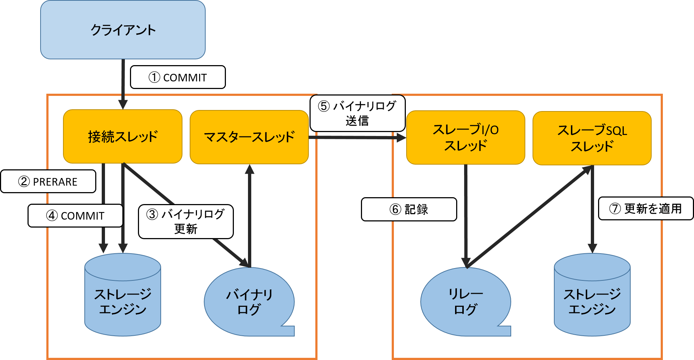
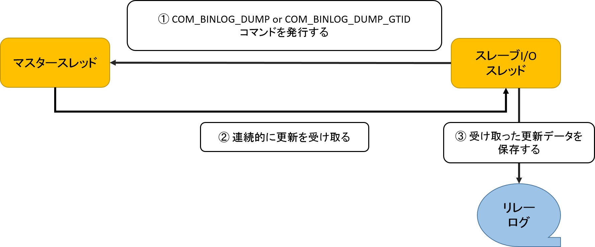
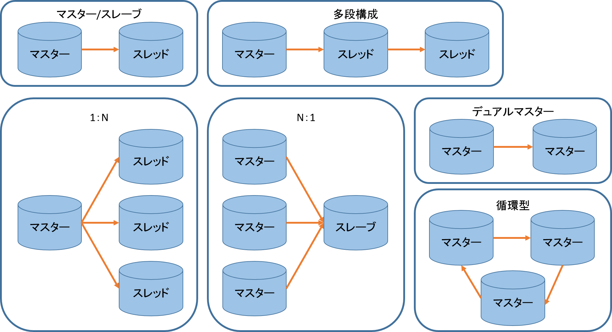

# レプリケーション
## 2-1. レプリケーションの基本構造
- 2つのDBに含まれるデータが同じであり、それに対して**加える変更も同じであれば、結果も同じ**
- 非同期型レプリケーション
  - あくまで、マスター側の変更ログをスレーブ側に**転送**している
  - ほんの僅かに遅れて、スレーブ側はマスターに追随する



### 2-1-1. バイナリログ
- MySQLサーバー上で発生したすべての変更を直列化し、記録する仕組み
  - 行った操作が記録されている

    | 操作 | 内容 |
    | :--- | :--- |
    | `SHOW BINARY LOGS` | バイナリログの確認 |
    | `SHOW BINLOG EVENYS` | バイナリログの中身の確認 |

- バイナリログには3種類の取り方がある

    | 種類 | 内容 | 弱点 |
    | :--- | :--- | :--- |
    | SBR（ステートメントベースレプリケーション） | SQL文そのものを記録する | UUIDなど、マスターとスレーブで実行結果が必ず一致しないSQLでも記録する。<br>そのため、マスターとスレーブでデータに差異が生じることがある<br>総じて**非決定性SQL**も保存するということ |
    | RBR（行ベースレプリケーション） | SQL実行時に変更が生じた行の変更前と変更後を記録する | **非決定性SQL**を保存しない代わりにバイナリログサイズが大きくなる |
    | MBR（Mixedベースレプリケーション） | 最初はSBRで保存をしようとし、非決定性SQLが出現したとき、RBRで記録する | ない |

### 2-1-2. レプリケーションを構成するスレッド
#### マスタースレッド
- マスターとスレッドの関係性は以下の通り

| 種類 | 形態 |
| :--- | :--- |
| マスター | サーバ |
| スレーブ | クライアント |

- 詳しくは上の図を参照するとわかりやすいが、マスタースレッドに接続するためには、接続スレッド、すなわちスレーブスレッドが必要

##### マスタースレッドの役割
- バイナリログをスレーブへ送ること
- 送るコマンドは以下の通りだが、両方共**プロトコルレベル**コマンドなので、**mysql CLI**を使って実行させることはできない

    | コマンド | 内容 |
    | :--- | :--- |
    | `COM_BINLOG_DUMP` | バイナリログファイル名とポジションによってバイナリログ送信のポジションを決定する |
    | `COM_BINLOG_DUMP_GTID` | GTIDによってバイナリログ送信ポジションを決定する<br>MySQL5.6以降の機能。 |

#### スレーブI/Oスレッド
- マスターに接続し、`COM_BINLOG_DUMP`あるいは`COM_BINLOG_DUMP_GTID`コマンドを発行する
- マスターから連続的に更新を受け取り、リレーログへ保存する



- リレーログにもインデックスファイルがあるので、`SHOW RELAYLOG EVENTS`で確認可能

#### スレーブSQLスレッド
- リレーログから更新の差分を読み取り、スレーブ上で再生するためのスレッド
- IOスレッドよりも**SQLスレッド**の方が**処理量が多く、処理が遅延しやすい**

### 2-1-3. レプリケーションのトポロジ
- マスターとスレッドの1:1構成もあるが、以下のように1:Nの構成などもある
- **負荷分散目的では、1:N構成が多い**
- デュアルマスター、循環型では、更新のタイミングによっては**データの不整合が起きるリスク**がある



## 2-2. レプリケーションのセットアップ概要
### 2-2-1. マスター側の設定
- バイナリログの有効化
- スレーブからの接続受け入れの準備

#### 2-2-1-1. server_idの設定
- レプリケーションを構成するMySQLサーバーは、いずれも**固有のID**を持つ
  - バイナリログにも記録される
  - これによって、どの**MySQLサーバーが更新の発信源か、認識できる**
- `server_id`は**32ビットの符号なし整数**で設定する
  - よく使われるのは、**IPアドレスのサブネット部分**を使用
  - 一つのホストで複数立てる場合（Dockerとか）は工夫が必要

#### 2-2-1-2. バイナリログの有効化
- `lon_bin`オプションを`my.cnf`に書いて再起動する

#### 2-2-1-3. スレーブ接続用アカウントの作成
- `REPLICATION SLAVE`を持ったユーザーを、スレーブからログイン可能な状態にする
- 作成例を下記に示す

    ```bash
    mysql> CREATE USER 'mokusen'@'192.168.30.0/255.255.255.0' IDENTIFIED BY 'secret';
    mysql> GRANT REPLICATION SLAVE ON *.* TO 'mokusen'@'192.138.30.0/255.255.255.0';
    ```

### 2-2-2. スレーブへデータをコピー
- 新規にマスターサーバを作成し、レプリケーションを行う場合は、コピーはいらない
- そうでない場合は、既存のMySQLサーバーをマスターとして、新規にスレーブを追加する場合、マスターからコピーを取る

#### コピー方法
1. マスター側でバイナリログを有効化する
2. マスター側で、バックアップを取得する
    - `mysqldump`コマンドで`--master-data=2`オプションを付けて実行する
3. バックアップを何かしらの方法でスレーブへリストアする

### 2-2-3. スレーブの設定
#### 2-2-3-1. server_idの設定
- `server_id`を設定する

#### 2-2-3-2. レプリケーションの設定
- レプリケーションの設定は、`CHANGE MASTER`
- 実行例を下記に示す

    ```bash
    mysql> CHANGE MASTER TO
        ->   MASTER_HOST=`マスターのホスト名またはIPアドレス`,
        ->   MASTER_PORT=3306,
        ->   MASTER_LOG_FILE=`mysql-bin.000777`,
        ->   MASTER_LOG_POS=12345678,
        ->   MASTER_HEARTBEAT_PERIOD=60;
    ```

- `MASTER_USER`と`MASTER_PASSWORD`が含まれていないのは、平文でパスワードが保存されるリスクから、MySQL5.6から警告が出るようになった
  - 実行すると、スレーブ上の`master.info`ファイルか、`mysql.slave_master_info`テーブルに平文保存される
- このリスクの回避法は、`START SLAVE`でログインに必要な情報を指定すること
  - SSL接続でない場合、盗聴される危険性があるので、気をつける

#### 2-2-3-3. レプリケーションの開始
- 実行例を下記に示す

    ```bash
    mysql> START SLAVE USER = 'mokusen' PASSWORD = 'secret';
    ```

- コマンドが正常に終了したか、確認するために、`SHOW SLAVE STATUS`を入力する
  - `Slave_IO_Running`および`Slave_SQL_Running`が**Yes**になっていることを確認する